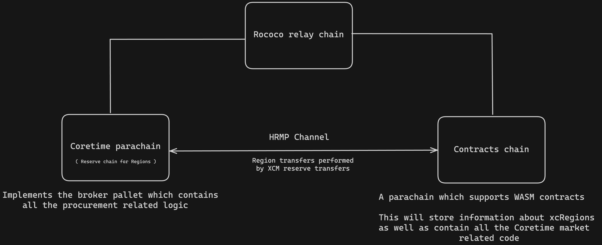

# Simulated Coretime Environment

The purpose of this directory is to consolidate all the necessary components for testing RegionX functionality in one place. This repository offers  scrits, simplifying the process of spinning up the required chains for testing.

## Topology

The local environment consists of three chains:

-   Rococo relay chain
-   Coretime parachain
-   Astar Shibuya parachain

<p align="center">
 
</p>

## Getting started with Zombienet

NOTE: Before proceeding make sure to have zombienet setup on your machine and accessible from your PATH.
You can find linux and macOS executables of the Zombienet CLI [here](https://github.com/paritytech/zombienet/releases)

```sh
# Clone the repo:
git clone https://github.com/RegionX-Labs/Coretime-Mock.git

# Pull the submodules:
git submodule update --init
```

To run the local environment, we will first need to get all the necessary binaries.

In case we want to run the full local network, which will allow us to test the contracts as well, we need to get the binary from the contracts parachain as well:

```sh
# This script compiles all the necessary binaries for running a Rococo relay chain,
# Coretime chain, and a smart contract chain.
./scripts/full_init.sh
```

Once everything has been successfully compiled, the local network can be started:
```
npm run zombienet:full
```

After waiting a few minutes for the network initialization and once **both** parachains **begin block production**, we can proceed to initialize the environment.

This repo provides an initialization program which will based on the selected options set up the local network accordingly. The program provides the following options:

1.  `--relayInit`:
    
    -   Description: Opens two HRMP channels: Coretime Chain <--> Contracts chain

2.  `--coretimeInit`:
    
    -   Description: Initializes the Coretime chain by setting the initial configuration, starting the bulk sale, and purchasing a region.

3.  `--coretimeAccount <string>`:
    
    -   Description: When specified the program will transfer the purchased region to this account.

4.  `--contractsInit`:
    
    -   Description: Initializes the contracts parachain by creating a collection that represents Coretime regions. Also, deploys both the `xc-regions` and the `coretime-market` contracts.
  
5.  `--mintXcRegions`:
    
    -   Description: Mints a couple of mock xc-regions. Convenient for testing the market functionality.

6.  `--contractsAccount <string>`:
    
    -   Description: When specified the program will transfer the mock xc-regions to this account.

7.  `--contractsPath <string>`:
    
    -   Description:  The path to the compiled contracts.

### Example: Testing contracts-related stuff only:

> NOTE: In this case, we don't need to run the zombienet network, instead it is expected that the `astar-collator` node is running in the background in `--dev` mode at port `9920`. 
> 
> Command for running the node:  `astar-collator --dev --rpc-port 9920`

1.  Compile the contracts in the RegionX directory. Before compilation ensure the uniques pallet index is configured correctly. In this case it should be set to 30: https://github.com/RegionX-Labs/RegionX?tab=readme-ov-file#4-deploy
	 ```sh
	cd RegionX/contracts/xc-regions
	cargo contract build

	cd ../coretime_market
	cargo contract build
	```

2.  After successful compilation, you can initialize the contracts chain with the command below.
	 ```sh
	npm run zombienet-init -- \
	--contractsInit \
	--contractsPath ../RegionX/target/ink/ \
	--contractsAccount "X2pK59cdJrdw4Ca7cNywKFtCc9bPMRGVefbeYWXa1GJJJsk" \
  	--mintXcRegions
	```

### Example: Testing with full environment
> NOTE: For the following to work, it is expected that you run `npm run zombienet:full` in the background.

1.  Compile the contracts in the RegionX directory. Before compilation ensure the uniques pallet index is configured correctly. In this case it should be set to 37: https://github.com/RegionX-Labs/RegionX?tab=readme-ov-file#4-deploy
	 ```sh
	cd RegionX/contracts/xc-regions
	cargo contract build

	cd ../coretime_market
	cargo contract build
	```
2.  After successful compilation and once all the parachains **started producing blocks**, you can initialize the full network setup using the command below.
	 ```sh
	npm run zombienet-init -- \
	--contractsInit \
	--coretimeInit \
	--relayInit \
	--contractsPath ../RegionX/target/ink/ \
	--contractsAccount "X2pK59cdJrdw4Ca7cNywKFtCc9bPMRGVefbeYWXa1GJJJsk" \
	--coretimeAccount "5DADsnBXr5DXiEAjdJvruf6c7ZSUR8iXUTATQqJfheGLiEVm"
	```

## Getting started with Chopsticks

The Coretime chain is already deployed on Rococo (🥳), allowing us to use Chopsticks for aspects of local frontend testing that do not require the xc-regions contract.

The steps to run a Coretime chain locally and setup the mock environment:

```sh
npm i

# This will run a parallel copy of the Coretime chain
npm run chopsticks

# In a new terminal:

# This will add some mock data to the Coretime chain
npm run chopsticks-init
```
